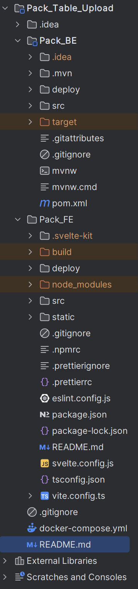

# Pack_Table_Upload Application

This project is a simple web application featuring a sortable table with file upload functionality, a form for resource submission, a drag-and-drop functionality and an i18n module with a Spring Boot backend, and a SvelteKit frontend served via Nginx. The entire application is containerized using Docker and orchestrated with Docker Compose.

## Features

*   Display resources in a sortable table.
*   Upload one or more attachments for each resource with drag and drop or by selecting files from the file system.
*   View and download individual attachments.
*   Internationalization support (English, Italian, Spanish) with a language switcher.
*   Responsive design for the upload form and modals.

## Tech Stack

*   **Frontend (Pack_FE):**
    *   SvelteKit (with `adapter-static`)
    *   TypeScript
    *   Svelte-i18n for internationalization
    *   Bootstrap Icons (via CDN)
    *   Served by Nginx
*   **Backend (Pack_BE):**
    *   Spring Boot 3.4.5
    *   Java 17
    *   Spring Data JPA
    *   PostgreSQL
    *   Maven
*   **Database:**
    *   PostgreSQL
*   **Containerization & Orchestration:**
    *   Docker
    *   Docker Compose

## Prerequisites

Before you begin, ensure you have the following installed on your system:

*   [Docker Desktop](https://www.docker.com/products/docker-desktop/) if you're on Windows, otherwise for Linux distros just install docker: https://www.digitalocean.com/community/tutorials/how-to-install-and-use-docker-on-ubuntu-22-04
*   A code editor (in my case IntelliJ IDEA).
*   Git

## Project Structure

An overview from the project root (`Pack_Table_Upload`):




## Getting Started

Follow these steps to get the application up and running locally using Docker Compose, you will find it on localhost:8080.

### 1. Clone the Repository

If you haven't already, clone the project repository.
Windows:
```bash
   git clone https://github.com/DevMiki/FiddlingWithSvelte.git; cd FiddlingWithSvelte
```
Linux:
```bash
   git clone https://github.com/DevMiki/FiddlingWithSvelte.git && cd FiddlingWithSvelte
```
### 2. Then spin it up with docker compose and you're set to go
```bash 
   docker-compose up -d